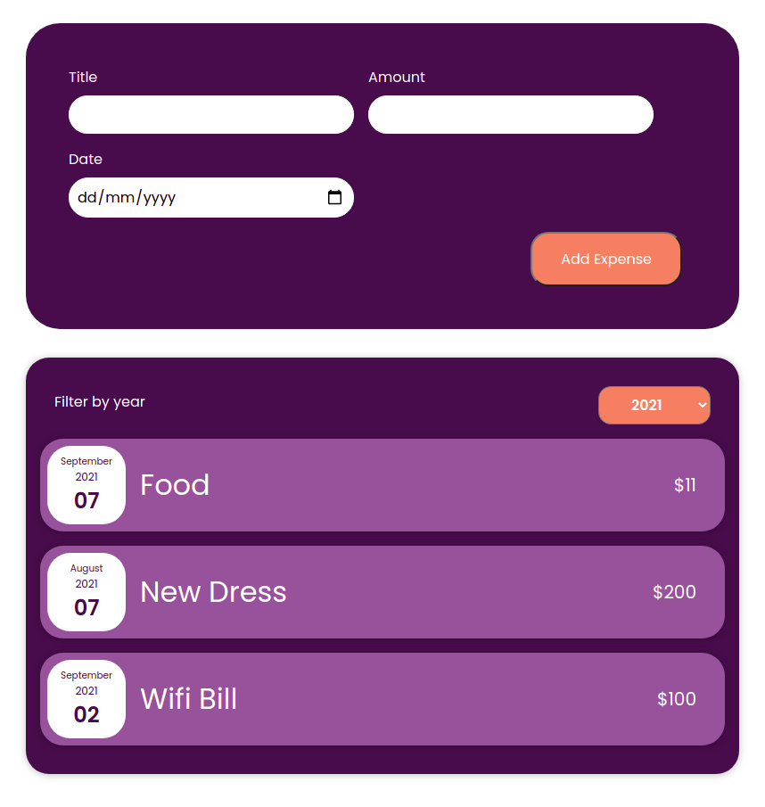
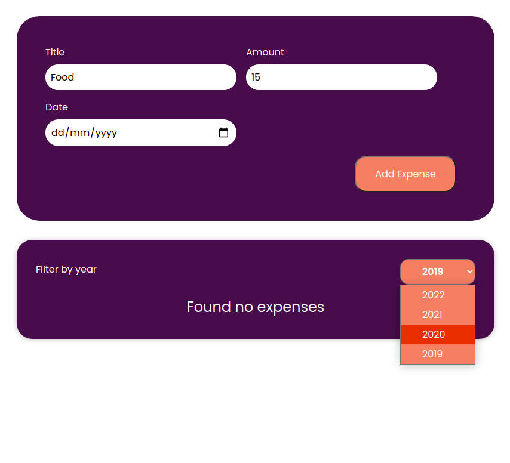

# React Expense Calculator app 💸

Expense Calculator app using reactjs

## Project Status 👨‍🔧 

This project is currently in development. Users can filter expenses by year. Functionality for vieing graphical representation of expenses by month is in progress.



## Installation and Setup Instructions 👨‍🏫

Clone down this repository. You will need ```node``` and ```npm``` installed globally on your machine.

Installation:

```npm install```

To Start Server:

```npm start```

To Visit App:

```localhost:3000/ideas```
